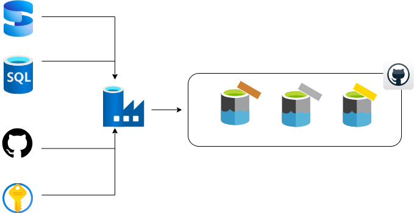

# 🏭 Azure Data Factory End -To-End

## 📌 Descripción
Este proyecto tuvo como objetivo fortalecer mis habilidades en Azure Data Factory, realizando la migración de tablas desde SQL Server mediante un **Integration Runtime Self-Hosted**.
Se implementó un sistema de alertas automáticas por correo electrónico utilizando **Logic Apps** para notificar fallos en los pipelines.
Además, se aplicó la **arquitectura Medallion** (Layers Bronze, Silver y Gold) para estructurar y optimizar el flujo de datos, garantizando una mayor calidad y trazabilidad en el proceso de transformación.

## 🎯 Objetivos

- Migrar datos de SQL Server a Azure con Integration Runtime.

- Aplicar arquitectura Medallion para optimizar datos.

- Configurar alertas automáticas con Logic Apps.

- Usar Azure Key Vault para mayor seguridad en credenciales.

## 🚀 Tecnologías Utilizadas
🛢  SQL Server

🏭 Azure Data Factory

🐙 GitHub

🔑 Azure Key Vault

## 💻 Desarrollo
Este proyecto, desarrollado en Azure Data Factory, consistió en la migración de tablas desde SQL Server y la extracción de datos en formato JSON desde GitHub.
Se implementó Azure Key Vault para reforzar la seguridad en el manejo de credenciales y se utilizó Azure Data Lake Gen2 para almacenar la información en las capas Bronze, Silver y Gold, aplicando control de versiones mediante GitHub.

  

## 📒 Grupo de recurso
